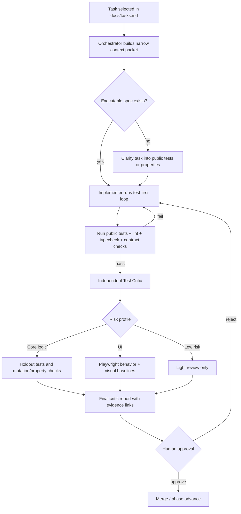
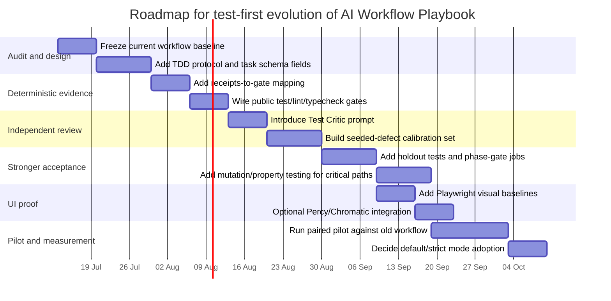

# TDD и тест-центричная агентная разработка для AI Workflow Playbook

## Исполнительное резюме

Этот отчёт отвечает на загруженный бриф как на конкретный прикладной кейс: нужно оценить, стоит ли развивать **AI Workflow Playbook** в сторону более жёсткой, тест-центричной, агентной разработки, где код пишется под тесты, тесты и орекулы отделены от имплементатора, а финальное решение о готовности принимается не по “ощущению агента”, а по набору проверяемых артефактов. Бриф также просит сопоставить Playbook с `obra/superpowers`, `vamplabAI/sgr-agent-core` и другими практиками агентного SWE. fileciteturn0file0

Ключевой вывод такой: **AI Workflow Playbook уже очень силён как governance-first система**, а не как “ещё один агентный рантайм”. В текущем публично доступном состоянии репозиторий уже имеет: явную модель зрелости гарантий, разделение ролей, детерминированные валидаторы, аудитные хуки, machine receipts, фазовые врата, требования к CI, capability-specific evaluation artifacts и правило, что оценивать нужно не только модель, а весь `model + prompt + tools + memory/state + retries + recovery + permissions + trace + HITL + eval`-контур. Но именно **явная test-first дисциплина для имплементатора**, **мутационное тестирование**, **скрытые holdout-тесты**, **калиброванный финальный critic** и **первая-классная визуальная регрессия для UI** в доступных core-артефактах пока не выглядят как обязательный, жёстко описанный слой. citeturn36view0turn32view5turn31view0turn31view2turn31view4

Внешняя литература и практики в целом подтверждают направление “больше тестов и больше независимой верификации”, но не подтверждают упрощённый тезис “достаточно просто добавить ещё одного LLM-reviewer”. TDD-подходы для LLM-кодогенерации действительно повышают корректность, а интерактивные test-driven циклы существенно улучшают pass@1. Одновременно исследования показывают, что LLM-reviewers часто переисправляют код, нестабильно оценивают одинаковые артефакты, демонстрируют position bias и в целом пока не заменяют независимые исполнимые проверки. Поэтому правильная эволюция Playbook — это не “сделать ещё более умного судью”, а **сделать более сильный набор орекул и доказательств**, а судью превратить в риск-ориентированный, калиброванный слой поверх детерминированных гейтов. citeturn38academia1turn38academia2turn38academia3turn24academia3turn26academia1turn26academia3turn23academia1turn23academia3

Моя практическая рекомендация: **да, двигать Playbook в сторону “Hyper-TDD / test-first agentic SWE” стоит, но не догматически**. Для core-логики и API — public tests first, затем реализация, затем independent test critic, затем mutation/property/holdout на merge- и phase-gate. Для UI — связка behavior tests + visual regression + точечный vision critic. Для low-risk задач — облегчённый режим, где обязательны хотя бы baseline tests, lint/typecheck и независимый review. Cross-model review полезен как **опциональный risk hedge**, но его не надо превращать в обязательный ритуал на каждый коммит: сегодня чуть важнее разделение ролей, независимый контекст и исполнимые доказательства, чем сам факт “другого вендора”. citeturn36view0turn20view0turn21view2turn33view1turn33view2turn29view0turn30view3turn28academia0

## Контекст и корпус источников

### Что именно я оценивал

Я оценивал не абстрактную идею TDD, а **конкретный вопрос о развитии AI Workflow Playbook**: стоит ли усиливать его в сторону test-first агентной разработки, как разделять имплементацию и проверку, как организовать финальный critic, где нужны скрытые тесты, как проверять UI и какие изменения лучше вносить в сам репозиторий. Эта рамка взята из загруженного брифа. fileciteturn0file0

Публично доступные артефакты Playbook, которые удалось проверить напрямую, показывают, что репозиторий публичный, находится на ветке `master`, содержит `hooks/`, `prompts/`, `schemas/`, `tests/`, `tools/`, `ci/`, `docs/` и на момент проверки имел 102 коммита. В корневом описании Playbook сам репозиторий характеризуется как governance-first workflow с “explicit, testable quality controls”, у которого зрелость контроля помечается как documented / formalized / enforced / tested / empirically validated. citeturn36view0

### Что дало наибольшую уверенность

Ниже — шесть наиболее полезных и достаточно авторитетных источников, которые реально формируют дизайн-решение для этого кейса.

| Источник | Что он надёжно показывает | Практическая ценность для Playbook |
|---|---|---|
| **AI Workflow Playbook root + PLAYBOOK.md** citeturn36view0turn8view0 | В репозитории уже есть зрелостная матрица гарантий, role separation, receipts, hooks, CI/phase gates, capability-eval gates и весь governance-first каркас | Это не нужно заменять; это нужно **достроить test-first и critic-calibration слоями** |
| **OpenAI Codex official** citeturn20view0 | Codex запускает задачи в изолированных sandbox-средах, умеет запускать tests/linters/type checkers, даёт terminal logs и test outputs, поддерживает `AGENTS.md`, но всё равно требует ручной проверки человеком | Хороший исполнительный слой для Playbook, особенно если делать merge authority не на словах агента, а на receipts и test evidence |
| **Anthropic Claude Code overview** citeturn33view0turn21view2turn21view3 | Claude Code поддерживает `CLAUDE.md`, hooks, MCP, CI usage, multiple/background agents и умеет брать на себя тесты и рутинные задачи | Удобный orchestration/review слой, особенно для hooks, multi-agent review и инструкций |
| **GitHub Copilot Docs** citeturn33view1turn21view4 | У Copilot есть cloud agent, custom agents, hooks, skills, code review, тестирование custom agents, firewall/secrets/environment controls | Подтверждает, что экосистема движется к policy-managed агентам, а не к “одной магической модели” |
| **Superpowers README** citeturn33view2 | Тут TDD наиболее явно артикулирован: RED-GREEN-REFACTOR, tests-first, subagent-driven development и двухступенчатый review | Это лучший внешний шаблон для того, как сделать TDD в Playbook **явным и обязательным**, а не подразумеваемым |
| **SGR Agent Core README** citeturn33view3 | Сильный акцент на schema-guided reasoning, agent types, production-ready тестовое покрытие и Docker-операбельность | Полезно не как TDD-референс, а как напоминание, что **схемы и state contracts** тоже должны быть первоклассными |

Дополнительно полезны `SWE-agent`, `OpenHands` и `Aider`: первый и второй хорошо показывают, насколько важны execution substrate и backend isolation, а третий — насколько практичным может быть лёгкий локальный loop с авто-lint/test без тяжёлой оркестрации. Но для вопроса именно о **test-first governance** они вторичны по сравнению с Playbook, Codex/Claude/Copilot и Superpowers. citeturn34view0turn34view1turn35view0turn35view2

### Важная оговорка об ограничениях проверки

Есть один значимый нюанс: текущий README Playbook всё ещё использует более сильный язык про “hard quality guarantees”, тогда как корневая страница репозитория и актуальный `PLAYBOOK.md` уже аккуратно различают зрелость гарантий и прямо пишут, что для prompt-only правил нельзя использовать blanket hard guarantee language. Это хороший сигнал зрелости — репозиторий сам ушёл от маркетингового абсолютизма к модели проверяемой зрелости. Но это также значит, что в отчёте ниже я специально различаю: **что в Playbook уже реально доказано**, **что только formalized**, и **что пока выглядит как архитектурное намерение, а не эмпирически подтверждённый эффект**. citeturn32view5turn36view0turn8view0

## Что говорит внешняя практика и исследования

### TDD и tests-as-specification действительно помогают, но тесты сами по себе не являются истиной

Для LLM-кодогенерации тесты действительно работают как более формальный и проверяемый носитель требований, чем один только natural-language prompt. Исследования TDD-style code generation показывают, что добавление тестов к постановке задачи улучшает результаты на function-level задачах, а интерактивный test-driven workflow существенно повышает корректность генерации. Более новое class-level исследование показывает, что test-driven генерация масштабируется и на многометодные классы, если использовать зависимостный граф, пошаговую реализацию и bounded repair loops. citeturn38academia2turn38academia1turn38academia3

Но и это не даёт права делать из public tests единственный oracle. Параллельная линия работ показывает, что generated tests нередко оптимизируются под coverage, а не под реальное обнаружение дефектов; property-based testing и mutant-based property coverage дают куда более содержательную оценку качества тестов. В одной из работ PBT используется именно для разрыва “cycle of self-deception”, когда и код, и тесты наследуют одну и ту же ошибочную интерпретацию задачи. citeturn25academia2turn25academia0turn25academia1

Практический вывод для Playbook: **public tests должны стать inner-loop спецификацией**, но для medium/high-risk модулей их надо дополнять хотя бы одним из трёх слоёв: property checks, mutation score, hidden holdout tests. Иначе система хорошо оптимизируется под видимый прокси, но хуже защищена от “правдоподобно правильного” кода. citeturn25academia0turn25academia2turn37academia0

### Self-debugging полезен, но plain-language reviewer сегодня слишком ненадёжен как финальный арбитр

Self-debugging — реальная и полезная техника. Классическая работа “Teaching Large Language Models to Self-Debug” показывает, что модель может улучшать код, используя execution results и объяснение собственного решения, и это действительно поднимает качество. То есть **внутренний repair loop** у имплементатора нужен. citeturn24academia3

Однако из этого не следует, что тот же тип модели должен быть и финальным судьёй. Более свежие исследования code review и LLM-as-a-judge показывают систематические проблемы: LLM-reviewers склонны переисправлять корректный код, single-trial judging нестабилен, а pairwise verdicts могут “переворачиваться” на одинаковых данных. Специальный benchmark для code review agents показывает, что совокупно текущие review-агенты решают лишь около 40% review-задач, то есть reviewer-слой пока нельзя считать самостоятельной гарантией качества. citeturn26academia1turn23academia1turn23academia3turn26academia3

Отсюда следует важный архитектурный принцип: **независимость reviewer-а должна обеспечиваться не только “другой моделью”, а другой ролью, другим контекстом и другими доказательствами**. Cross-vendor critic полезен как дополнительный хедж на high-risk задачах, но системная надёжность приходит прежде всего из role separation, fresh context, deterministic gates, fix-guided verification и hidden acceptance checks. Это уже очень близко к тому, как сам Playbook формулирует свои сильные стороны. citeturn36view0turn31view5turn37academia1

### Почему нужны hidden tests, holdouts и critic calibration

Современные coding-agent benchmarks уже сталкиваются с contamination и proxy gaming. Появились работы, показывающие, что результаты на SWE-Bench Verified могут быть частично завышены за счёт memorization, а deep-research и agentic systems подвержены search-time contamination, когда агент получает benchmark leakage прямо через web search. Отдельно code-review benchmarks уже используют held-out tests как quality gate для agent-generated reviews. citeturn24academia2turn24academia0turn37academia3turn26academia3

Поэтому для Playbook логично развести два слоя. **Public tests** нужны для скорости и объяснимой программной итерации. **Holdout tests** нужны для phase gate, merge gate и эмпирической оценки самого workflow, иначе Playbook может начать оптимизироваться под свои же видимые критерии. Это особенно важно, если позже появится “final critic”, потому что judge-only системы тоже оказываются смещёнными и чувствительными к формулировке задачи. citeturn23academia1turn23academia3turn37academia0

### UI нельзя проверять только DOM-тестами или только vision-critic’ом

Для UI и frontend work текущая внешняя практика достаточно ясна. Playwright поддерживает screenshot baselines через `toHaveScreenshot()`, хранение golden snapshots в репозитории, обновление baselines и способы стабилизации окружения, включая `stylePath` для исключения динамических элементов. Percy и Chromatic строят поверх этого полноценный visual-review слой с baselines, diff review, responsive widths, dynamic-content handling и PR feedback. При этом исследования по VISTA показывают, что визуальная точность и функциональная корректность у coding agents частично развязаны: можно получить поведенчески рабочий UI с плохой визуальной близостью и наоборот. citeturn29view0turn30view3turn29view1turn28academia0

Практический вывод: в Playbook **vision critic должен быть не заменой Playwright/Percy/Chromatic, а третьим уровнем**. Сначала behavior tests, затем visual regression baselines, и только затем — vision-language critic для случаев, где нужно сравнивать сложный layout, дизайн-фиделити или сложно формализуемые визуальные дефекты. citeturn29view0turn30view3turn28academia0

## Аудит текущего состояния AI Workflow Playbook

### Что уже выглядит сильным и зрелым

В текущем состоянии Playbook уже хорошо решает то, что большинство “AI coding workflows” не решают вообще: **кто имеет право писать код, кто имеет право судить, где живёт state, что считается доказательством и когда claim вообще разрешено произносить**. Корневые документы прямо фиксируют machine-readable task blocks, deterministic validation, baseline tracking, phased review, immutable contracts, hooks для immutable files, receipts, evidence bundles и capability-specific evaluation artifacts. Более того, в описании зрелости прямо указано, что часть вещей “Tested”, часть только “Formalized”, а project-specific empirical claims требуют собственных fixtures, traps, scorers и evidence bundles. Это очень правильный фундамент. citeturn36view0turn8view0

Особенно важно, что сам Playbook уже формулирует правильную единицу оценки для агентных систем: не “модель”, а весь harness. Это хорошо совпадает с внешними исследованиями по агентному SWE, где deployment mode, tool access, task type и evaluation protocol оказываются не менее важны, чем базовая модель. citeturn36view0turn17academia14turn0academia2

### Где видны пробелы именно для test-first эволюции

В доступном `PLAYBOOK.md` я **не нашёл явного TDD-first языка**. Там очень сильный акцент на tests, CI, verification evidence, bounded correction и review, но не на формулу “сначала failing test, затем минимальный код, затем refactor”. Слово `TDD` в полученном `PLAYBOOK.md` не обнаруживается; аналогично не обнаруживается `holdout`, а явного блока про visual testing там тоже нет. Слово `mutation` встречается, но в контексте runtime/toolchain mutation boundaries, а не mutation testing test-suite adequacy. citeturn31view0turn31view2turn31view4turn31view1

Это не значит, что Playbook “слаб в тестах”. Напротив: README и root page подчёркивают baseline tracking, CI in Phase 1, capability eval gates и hooks. Это значит лишь, что **в текущем core нет первого-классного TDD dialect-а**, как у Superpowers, и нет столь же явного слоя для hidden acceptance checks, mutation score и visual baselines. citeturn32view5turn36view0turn33view2

### Сводный аудит по ключевым control areas

| Зона контроля | Что видно в текущем Playbook | Оценка |
|---|---|---|
| Role separation | Явно зафиксировано: implementer не review’ит себя, reviewer не пишет код, orchestrator не пишет app code citeturn36view0turn31view5 | **Сильно** |
| Machine-readable tasks | Есть `schemas/task.schema.json`, `tools/playbook_validate.py`, unit tests validator’а, maturity = Tested citeturn36view0 | **Сильно** |
| Receipts и evidence bundles | Есть command receipts и evidence bundle validation, но external attestation / project-specific proof ещё не полный слой citeturn36view0 | **Сильно, но не завершено эмпирически** |
| Hooks и immutable contract | Есть `guard_files.sh`, audit хуки, settings для Claude, maturity “Tested when hooks installed” citeturn36view0turn32view2 | **Сильно** |
| CI и baseline tracking | CI обязателен для Standard/Strict, baseline tracking описан оба раза — в README и PLAYBOOK citeturn32view5turn8view0 | **Сильно** |
| Capability-specific evaluation | Есть eval artifacts и Step 3.5 gate, но project-specific proof должен строиться отдельно citeturn36view0 | **Сильно концептуально, неполно продуктово** |
| TDD-first implementer protocol | В fetched core docs явного TDD/TDD-first протокола нет citeturn31view0 | **Недостроено** |
| Hidden/holdout tests | В fetched core docs явного holdout-слоя нет citeturn31view2 | **Недостроено** |
| Mutation testing | Явного mutation-testing gate нет; “mutation” используется в другом смысле citeturn31view1 | **Недостроено** |
| Visual regression/UI proof | В fetched core docs явного visual-testing слоя нет citeturn31view4 | **Недостроено** |
| Final critic calibration | Есть review-cycle, но нет видимого в core слоя с judge calibration against seeded defects / holdouts citeturn36view0turn8view0 | **Недостроено** |

### Сопоставление с соседними практиками

Если сравнивать с `obra/superpowers`, то Superpowers гораздо жёстче и понятнее артикулирует именно **TDD как обязательную операционную дисциплину**: failing test → minimal code → passing test → commit, плюс subagent-driven development и двухступенчатый review. Если сравнивать с `sgr-agent-core`, то SGR лучше напоминает о необходимости schema-guided state contracts и production-ready harness, но не даёт такого явного TDD-loop в доступном README. Codex, Claude Code и Copilot подтверждают, что hooks, instructions, sandboxes, agent skills и code review уже стали “нормой рынка”, то есть Playbook не выдумывает странный слой, а может достаточно естественно встроиться поверх mainstream tooling. citeturn33view2turn33view3turn20view0turn33view0turn33view1

Мой вывод по аудиту простой: **Playbook уже хороший “control plane”, но ещё не идеальный “test-first execution doctrine”**. Именно это и стоит добавить. citeturn36view0turn33view2

## Целевая операционная модель и изменения в репозитории

### Какая модель лучше всего подходит

Для Playbook я рекомендую следующую целевую схему: Orchestrator остаётся центром state и policy; implementer получает **public executable spec**; затем проходят deterministic checks; затем идёт **independent test critic**; затем, по risk profile, добавляются holdout / mutation / visual gates; финальное решение остаётся за человеком, но только после того, как репозиторий собрал нужный набор доказательств. Это согласуется и с самим Playbook, и с тем, как Codex, Claude Code и GitHub Copilot организуют instructions, hooks, sandboxes и agent sessions. citeturn36view0turn20view0turn33view0turn33view1



Такая схема лучше отражает современную внешнюю практику, чем однослойный “LLM написал — LLM же проверил”. TDD-подобные loops улучшают качество генерации, но финальной властью над завершённостью должен обладать не reviewer-монолог, а сочетание исполнимых проверок, независимого критика и human approval. citeturn38academia1turn38academia2turn26academia1turn23academia1turn36view0

### Кому и чему давать completion authority

| Сценарий | Что должно считаться достаточным | Completion authority |
|---|---|---|
| Низкорисковые docs/config/refactor без изменения semantics | Green lint/typecheck/tests, light review, traceable receipt citeturn36view0turn20view0 | Human reviewer после deterministic gates |
| Core backend / business logic | Public tests, lint/typecheck, independent test critic, receipt/diff evidence citeturn38academia2turn26academia1turn36view0 | Human reviewer, critic advisory |
| Security/compliance/high-blast-radius | Всё выше + holdout tests + mutation/property checks + adversarial review framing citeturn25academia0turn25academia2turn37academia2 | Human approver обязателен, critic и hidden gates блокирующие |
| UI / frontend fidelity | Behavior tests + visual baselines + human visual review; vision critic опционален как дополнительный слой citeturn29view0turn30view3turn28academia0 | Human approver обязателен |

Здесь принципиально важно, что **critic не должен иметь абсолютную merge-власть**. Исследования judge reliability показывают, что single-shot verdicts слишком шумные для высоких ставок. Поэтому critic — это блокирующий слой только тогда, когда он либо ссылается на детерминированный провал, либо проходит через специально калиброванный высокорисковый protocol. citeturn23academia1turn23academia3turn26academia1

### Какие изменения я бы внёс в сам репозиторий

Ниже — конкретные изменения, которые наиболее полезно добавить в Playbook как next version of the method.

| Изменение | Что добавить | Зачем |
|---|---|---|
| Явный TDD-путь для implementer | `prompts/IMPLEMENTER_TDD.md` и `docs/testing/test_first_protocol.md` | Чтобы test-first был не подразумеваемым, а first-class workflow, как в Superpowers citeturn33view2turn31view0 |
| Поля task schema для test governance | Добавить в `schemas/task.schema.json` и templates поля вроде `public_tests_required`, `holdout_group`, `mutation_required`, `visual_contract`, `risk_level`, `critic_required` | Чтобы Orchestrator и validator могли принимать решения без LLM-угадывания; это в духе уже существующего machine-readable task model citeturn36view0 |
| Independent Test Critic | Новый prompt `prompts/audit/PROMPT_TEST_CRITIC.md` с фокусом на требования, недостающие кейсы, oracle gaps, flaky signals, overfitting under public tests | Plain-language review ненадёжен, но отдельный critic полезен как structured adversarial layer поверх deterministic evidence citeturn26academia1turn26academia3 |
| Holdout acceptance layer | `tests/holdout/` или отдельный CI stage с phase-gate execution | Защита от public-test overfitting, memorization и metric gaming citeturn24academia2turn37academia3 |
| Mutation / property testing layer | `docs/testing/property_oracles.md`, gate для Pitest/Mutmut/Stryker/Hypothesis/QuickCheck-analogues по стеку | Coverage не равен fault detection; property/mutation усиливают oracle quality citeturn25academia2turn25academia0 |
| UI evidence protocol | `docs/testing/ui_verification.md` и шаблоны для Playwright `toHaveScreenshot`, Percy/Chromatic usage | UI quality частично независима от behavior correctness; visual layer нужен отдельно citeturn29view0turn30view3turn29view1turn28academia0 |
| Final critic calibration | `docs/evaluation/CRITIC_CALIBRATION.md` и seeded-defect bank | Judge bias и instability требуют калибровки critic’а на заранее размеченных дефектах citeturn23academia1turn26academia1 |
| Merge authority policy | `docs/merge_authority.md` с explicit stop-ship rules | Чтобы “task complete” определялось артефактами, а не успешной риторикой агента citeturn36view0turn20view0 |

### Нужен ли отдельный final critic и должен ли он быть кросс-модельным

Нужен, но в строго ограниченной роли. Final critic должен отвечать не на вопрос “нравится ли мне код?”, а на вопрос: **есть ли у набора доказательств право на phase advance / merge**. Его вход — не только diff, но и public/holdout test results, mutation/property отчёты, UI baselines, runtime receipts и ясный mapping task → acceptance criteria → evidence. Такой critic должен быть ближе к **evidence auditor**, чем к “ещё одному архитектору с мнением”. citeturn36view0turn37academia1

Делать ли critic обязательно cross-vendor — я бы не стал. Более аккуратная позиция такая: **по умолчанию** достаточно independent session + fresh context + strict prompt + deterministic evidence. **Для high-risk задач** стоит включать второй, более adversarial review, и именно там vendor diversity может дать дополнительную пользу. Но сегодняшняя литература даёт гораздо более сильные основания для разделения ролей и добавления исполнимых орекул, чем для универсального тезиса “другая модель всегда лучше судит”. Это мой вывод как инженерная интерпретация имеющихся данных, а не прямой экспериментальный факт. citeturn24academia3turn26academia1turn23academia1turn36view0

## Валидация, дорожная карта и приоритетные источники

### Как проверять, что новый подход реально лучше

Playbook сам уже правильно говорит, что механизм валидатора и сам проектовый эффект — разные вещи. Поэтому валидация должна быть двухслойной. Сначала нужно доказать, что новая machinery вообще работает: задачи размечаются, receipts собираются, hidden tests и UI baselines исполняются, critic produce’ит структурированные verdicts. Затем — что workflow **улучшает проектовые исходы**, а не просто усложняет процесс. Это соответствует собственным правилам Playbook о project-specific fixtures, traps и scorers. citeturn36view0

Я бы рекомендовал такой минимальный набор метрик для эмпирической проверки внутри одного-двух реальных репозиториев: pass rate по public tests, pass rate по hidden tests, mutation score на критических модулях, доля critic false alarms, доля critic misses на seeded defects, среднее число repair turns, time-to-green, частота rollback/reopen после merge, и для UI — отдельно behavior pass rate и visual regression defects caught pre-merge. Нельзя оценивать critic по его строгости как таковой: reward hacking и LLM-judge instability делают такую метрику опасной. Критик должен оптимизироваться под recall/precision на калибровочном наборе, а не под “процент заблокированных PR”. citeturn37academia0turn23academia1turn26academia1turn26academia3

### Рекомендованный порядок внедрения



Такой порядок делает сначала дешёвые и высокоокупаемые вещи: тестовый протокол, schema fields, deterministic gates, critic as auditor. Самые дорогие элементы — hidden tests, mutation/property и visual baselines — лучше вводить после того, как основной loop уже стабилен. Это соответствует и экономике агентного tooling, и тому, что vendor docs и внешние практики сначала усиливают instructions/hooks/tests, а уже потом прибавляют более дорогие orchestration and review layers. citeturn20view0turn33view0turn33view1turn33view2turn35view2

### Приоритетный backlog

| Приоритет | Элемент | Почему сейчас |
|---|---|---|
| Высокий | Сделать TDD first-class prompt и policy | Сейчас тесты важны, но test-first не сформулирован явно в core docs citeturn31view0turn33view2 |
| Высокий | Добавить `risk_level` и `critic_required` в task model | Это позволит включать дешёвый или строгий режим детерминированно, без ручного ad hoc выбора citeturn36view0 |
| Высокий | Ввести structured Test Critic | Plain-language critics слишком шумные без строгой рамки и evidence mapping citeturn26academia1turn23academia1 |
| Высокий | Ввести hidden acceptance tests для phase gates | Иначе workflow будет частично оптимизироваться под public tests и видимые артефакты citeturn24academia2turn37academia3 |
| Средний | Mutation/property gates only for critical modules | Это сильно усиливает oracle quality, но дороже операционно citeturn25academia0turn25academia2 |
| Средний | UI verification protocol с Playwright + visual baselines | Особенно важно, если Playbook используется для agentic frontend work citeturn29view0turn30view3turn28academia0 |
| Средний | Калибровка critic на seeded defects | Позволит управлять recall/precision вместо субъективной строгости citeturn23academia1turn26academia1 |
| Низкий | Cross-vendor critic по умолчанию | Полезен точечно, но не является самым сильным первым рычагом citeturn24academia3turn26academia3 |

### Неуточнённые ограничения, которые стоит зафиксировать отдельно

В исходном брифе не уточнены, но сильно влияют на дизайн: основной стек языков и тестовых фреймворков; допустимые вендоры и data-residency ограничения; бюджет на CI/LLM/reruns; доля UI-работы в проекте; требования к хранению evidence; допустимость flaky-test quarantine; и уровень security/compliance риска. Пока этих ограничений нет, я рекомендую делать архитектуру **risk-tiered**, а не “один строгий режим на всё”. fileciteturn0file0

### Приоритетный список источников

Ниже — рекомендованный список для дальнейшей работы, в порядке практической полезности для внедрения. Сначала — core design docs и официальные vendor docs; затем — внешние workflow-референсы; затем — papers для calibration и evaluation design. citeturn36view0turn20view0turn33view0turn33view1turn33view2turn33view3

```text
1. https://github.com/ashishki/AI_workflow_playbook
2. https://raw.githubusercontent.com/ashishki/AI_workflow_playbook/master/PLAYBOOK.md
3. https://raw.githubusercontent.com/ashishki/AI_workflow_playbook/master/README.md
4. https://openai.com/index/introducing-codex/
5. https://code.claude.com/docs/en/overview
6. https://docs.github.com/en/copilot
7. https://raw.githubusercontent.com/obra/superpowers/main/README.md
8. https://raw.githubusercontent.com/vamplabAI/sgr-agent-core/main/README.md
9. https://raw.githubusercontent.com/SWE-agent/SWE-agent/main/README.md
10. https://raw.githubusercontent.com/All-Hands-AI/OpenHands/main/README.md
11. https://raw.githubusercontent.com/Aider-AI/aider/main/README.md
12. https://playwright.dev/docs/test-snapshots
13. https://www.browserstack.com/percy/visual-testing
14. https://www.chromatic.com/storybook
15. https://arxiv.org/abs/2402.13521
16. https://arxiv.org/abs/2404.10100
17. https://arxiv.org/abs/2602.03557
18. https://arxiv.org/abs/2304.05128
19. https://arxiv.org/abs/2603.00539
20. https://arxiv.org/abs/2603.23448
21. https://arxiv.org/abs/2406.07791
22. https://arxiv.org/abs/2606.13685
23. https://arxiv.org/abs/2506.18315
24. https://arxiv.org/abs/2307.04346
25. https://arxiv.org/abs/2605.26144
26. https://arxiv.org/abs/2506.12286
27. https://arxiv.org/abs/2606.05241
28. https://arxiv.org/abs/2605.03952
```

Итоговый инженерный вердикт: **Playbook уже является сильным governance-слоем для агентной разработки, но следующий качественный скачок для него — не “ещё больше reviewer-агентов”, а “explicit test-first execution doctrine + stronger oracles + calibrated evidence-driven final critic”**. Если это реализовать аккуратно, Playbook сможет соединить лучшее из собственного governance-first подхода, superpowers-style TDD и современных vendor agent capabilities, не превратившись при этом в хрупкую систему из красивых, но плохо проверяемых обещаний. citeturn36view0turn33view2turn20view0turn33view0turn33view1turn26academia1turn23academia1