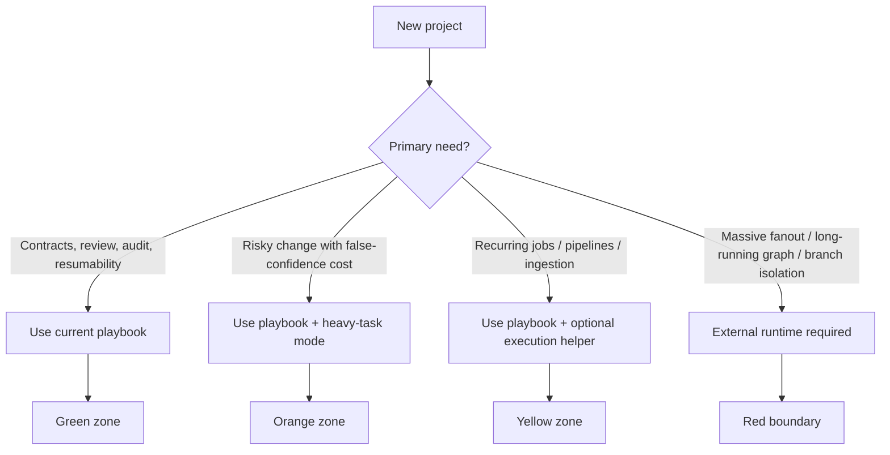

# Coverage Experiment Report

_Дата: 2026-04-01_
_Репозиторий: `ashishki/AI_workflow_playbook`_

## 1. Executive Summary

Эксперимент подтверждает основную гипотезу. Текущий playbook силён как governance/control-plane для AI-assisted engineering: он хорошо покрывает task contracts, role separation, review gates, resumability, auditability и proof-aware delivery через Phase 1, `CODEX_PROMPT`, immutable contract, two-tier review и capability-specific eval gates.

Граница проходит там, где orchestration становится главным продуктом: massive fanout, длительные графы задач, branch isolation, merge/reconcile множества параллельных агентов, повторяемые execution loops и runtime-level scheduling. Здесь playbook остаётся полезным governance layer, но уже не является достаточным execution substrate. Heavy-task mode в HEAD есть, но он селективный и proof-first, а не отдельный runtime.

## 2. Current Architectural Reading of the Playbook

Сегодня это:

- governance-first operating system для engineering work, а не generic orchestrator
- control-plane с жёстким lifecycle: Strategist → Validator → Orchestrator → Codex task execution → Light/Deep review → human phase gate
- artifact-centric system: unit of work это task block с `Owner/Phase/Type/Depends-On/Objective/Acceptance-Criteria/Files`, optionally `Execution-Mode: heavy`
- resumable state machine: `CODEX_PROMPT.md` хранит baseline, next task, findings, profile state, eval history
- proof/evidence layer: eval artifacts, NFR tracking, heavy-task durable evidence, profile-specific regression gates
- packaging/harness: bootstrap commands, Claude hooks, validator, CI template, retrofit flow

Сегодня это не:

- полноценный DAG runtime
- distributed multi-agent scheduler
- branch/worktree manager
- remote execution fabric
- built-in provider/runtime abstraction layer

## 3. Test Portfolio

1. FastAPI multi-tenant support copilot API с evals.
2. Slack research digest pipeline.
3. Document intelligence + retrieval summarization service.
4. Auth + RLS migration для production multi-tenant SaaS.
5. Monorepo audit swarm и remediation planner.
6. Playbook bootstrap kit для новых репозиториев и Claude/Codex integration.

## 4. Scenario-by-Scenario Coverage Analysis

### 4.1. FastAPI Multi-Tenant Support Copilot API

- Summary: средний backend с FastAPI/Postgres/Redis, 2-5 инженеров, LLM feature для internal support triage, multi-tenancy, обычные API риски, evals на answer quality.
- Why this is a good test: это естественный класс для playbook, где contracts, CI, review split и baseline discipline важнее, чем сложный runtime.
- Workflow shape: phase-based, mostly linear, occasional branching, low parallelism.
- Coverage classification: Excellent fit
- Heavy-task applicability: heavy-task mode not needed
- Need for external runtime: not needed
- Main failure modes: excessive ceremony для low-risk tasks, раннее включение лишних capability profiles, не до конца заполненный CI template.
- Recommendation: use as-is

Scores:

- Architectural fit: 5 - это ровно тот класс, под который рассчитаны solution-shape, governance и runtime right-sizing.
- Governance fit: 5 - contracts/reviews/gates дают прямую пользу.
- Orchestration demand: 1 - сложный scheduler не нужен.
- Proof/evidence demand: 3 - evals полезны, но не доминируют.
- Auditability demand: 4 - multi-tenancy и support data требуют следов изменений.
- Resumability demand: 4 - полезно для длинных feature циклов.
- Parallelism demand: 2 - независимые задачи иногда можно распараллелить, но вручную.
- Operational complexity: 2 - обычный сервисный контур.
- Cognitive load on operator: 2 - умеренный, если держать tasks маленькими.
- Template sufficiency: 5 - текущие templates почти полностью достаточны.
- Need for heavy-task mode: 1 - почти не нужен.
- Need for external runtime: 0 - не нужен.
- Packaging/installability relevance: 4 - greenfield/retrofit flow реально важен.
- Overall suitability: 5 - один из лучших fits.

### 4.2. Slack Research Digest Pipeline

- Summary: pipeline ingest → normalize → cluster → summarize → rank → render → publish в Slack, команда 2-4 человека, риски качества summary, stale inputs, scheduling and export correctness.
- Why this is a good test: проверяет structured pipeline zone, где есть стадии и артефакты, но governance всё ещё важнее orchestration fabric.
- Workflow shape: phase-based pipeline, iterative, умеренно branching.
- Coverage classification: Strong fit
- Heavy-task applicability: useful but optional
- Need for external runtime: helpful later
- Main failure modes: manual orchestration вокруг recurring runs, artifact sprawl, unclear stop conditions для iterative quality tuning.
- Recommendation: use with selected template changes

Scores:

- Architectural fit: 4 - pipeline хорошо описывается task/phase model.
- Governance fit: 5 - review and contract discipline очень полезны.
- Orchestration demand: 2 - есть стадийность, но без тяжёлого fanout.
- Proof/evidence demand: 3 - quality snapshots и regression checks желательны.
- Auditability demand: 3 - полезно, но не regulatory-level.
- Resumability demand: 4 - pipeline tuning часто прерывается и возобновляется.
- Parallelism demand: 2 - ingest/render/export можно временами разводить.
- Operational complexity: 3 - уже больше moving parts.
- Cognitive load on operator: 3 - orchestration ручная, но терпимая.
- Template sufficiency: 4 - нужны лишь pipeline/eval-specific additions.
- Need for heavy-task mode: 2 - полезен для ranking/summary-policy changes.
- Need for external runtime: 2 - позже поможет scheduler/job runner.
- Packaging/installability relevance: 3 - умеренно важно.
- Overall suitability: 4 - хороший fit, но execution loop уже снаружи.

### 4.3. Document Intelligence + Retrieval Summarization Service

- Summary: ingestion of docs, chunking, embedding, retrieval, summarization, export report; команда 3-6 человек; риски retrieval regressions, evidence mismatch, stale index, hallucinated summaries.
- Why this is a good test: это лучший тест на то, насколько RAG profile действительно operationalized, а не просто задекларирован.
- Workflow shape: phase-based plus proof-heavy around retrieval semantics.
- Coverage classification: Strong fit
- Heavy-task applicability: strongly recommended
- Need for external runtime: helpful now
- Main failure modes: manual upkeep of retrieval_eval, дорогая attribution логика code-vs-corpus, recurring ingestion/reindex orchestration вне core.
- Recommendation: use with heavy-task mode

Scores:

- Architectural fit: 4 - playbook явно проектировался с RAG profile.
- Governance fit: 5 - один из самых сильных профилей в репо.
- Orchestration demand: 3 - ingestion/reindex/export уже требуют execution plumbing.
- Proof/evidence demand: 5 - retrieval needs explicit proof.
- Auditability demand: 4 - нужен явный trail по corpus/version/eval.
- Resumability demand: 4 - многосессионные tuning loops типичны.
- Parallelism demand: 2 - есть, но не главный фактор.
- Operational complexity: 4 - data + eval + serving.
- Cognitive load on operator: 4 - evidence upkeep и regression reasoning дороже.
- Template sufficiency: 5 - `RETRIEVAL_EVAL`, task tags и review checks сильные.
- Need for heavy-task mode: 4 - особенно для retrieval-policy changes.
- Need for external runtime: 3 - ingestion scheduler и batch execution полезны уже сейчас.
- Packaging/installability relevance: 3 - secondary.
- Overall suitability: 4 - сильный fit, если не путать governance с ingestion runtime.

### 4.4. Auth + RLS Migration for Multi-Tenant SaaS

- Summary: production migration auth boundaries, `SET LOCAL app.tenant_id`, RLS policies, secrets rotation, rollback plan; 4-8 инженеров plus security/platform; высокий blast radius.
- Why this is a good test: это чистый proof-first/high-risk case, где обычные tests + review могут быть недостаточны.
- Workflow shape: proof-heavy, branching, rollback-aware, safety-gated.
- Coverage classification: Strong fit
- Heavy-task applicability: mandatory for safety/quality
- Need for external runtime: helpful now
- Main failure modes: недостаточно формализованные proof semantics без дополнительных артефактов, documented-but-not-executed rollback, operator overload.
- Recommendation: use with heavy-task mode and optional execution helper

Scores:

- Architectural fit: 4 - как governance layer очень силён.
- Governance fit: 5 - это почти идеальный risk-governance use case.
- Orchestration demand: 3 - rollout execution уже важен, но вторичен governance.
- Proof/evidence demand: 5 - без proof-first риск слишком велик.
- Auditability demand: 5 - обязательна.
- Resumability demand: 5 - миграции и findings часто идут через несколько циклов.
- Parallelism demand: 2 - есть локально, но осторожный sequencing важнее.
- Operational complexity: 5 - security, DB, rollback, compliance.
- Cognitive load on operator: 4 - много gates и cross-checks.
- Template sufficiency: 4 - heavy-task exists, но артефакты intentionally underspecified.
- Need for heavy-task mode: 5 - обязателен.
- Need for external runtime: 3 - rollout tooling нужен уже сейчас.
- Packaging/installability relevance: 2 - не главный вопрос.
- Overall suitability: 4 - очень полезен, но не как единственный rollout mechanism.

### 4.5. Monorepo Audit Swarm and Remediation Planner

- Summary: большой monorepo audit, десятки подпроектов, fanout на параллельные subagents, findings merge/reconcile, cross-team remediation queue.
- Why this is a good test: это boundary stress-test на честную архитектурную границу playbook.
- Workflow shape: highly parallel, iterative, fanout/merge, long-running graph.
- Coverage classification: Partial fit
- Heavy-task applicability: useful but optional
- Need for external runtime: required
- Main failure modes: too much manual orchestration, weak parallel branch coordination, merge ambiguity, operator cognitive overload, unclear stop conditions.
- Recommendation: use with optional execution helper only as governance layer

Scores:

- Architectural fit: 2 - core loop слишком task-sequential.
- Governance fit: 4 - findings and reviews всё ещё ценны.
- Orchestration demand: 5 - здесь она доминирует.
- Proof/evidence demand: 3 - нужен findings proof, но не это главный bottleneck.
- Auditability demand: 4 - важно при массовых remediation waves.
- Resumability demand: 5 - длинные кампании требуют durable state.
- Parallelism demand: 5 - ключевой фактор.
- Operational complexity: 5 - очень высокая.
- Cognitive load on operator: 5 - без внешнего runtime перегруз почти неизбежен.
- Template sufficiency: 2 - templates не покрывают swarm coordination.
- Need for heavy-task mode: 2 - местами полезен, но не решает core problem.
- Need for external runtime: 5 - фактически обязателен.
- Packaging/installability relevance: 3 - важно, но вторично относительно execution.
- Overall suitability: 2 - только как governance overlay.

### 4.6. Playbook Bootstrap Kit for New Repos

- Summary: reusable operating kit for new repos with Claude/Codex hooks, bootstrap commands, baseline CI and governance scaffolding.
- Why this is a good test: проверяет зрелость playbook как productized package, а не только как internal doctrine.
- Workflow shape: bootstrap then phase-based customization.
- Coverage classification: Strong fit
- Heavy-task applicability: heavy-task mode not needed
- Need for external runtime: not needed
- Main failure modes: unresolved placeholders, uneven retrofit quality, bootstrap UX depends on operator competence.
- Recommendation: use with selected template changes

Scores:

- Architectural fit: 4 - хорошо как reusable control-plane kit.
- Governance fit: 5 - это и есть его core value.
- Orchestration demand: 1 - минимальная.
- Proof/evidence demand: 2 - mostly validator-level.
- Auditability demand: 3 - useful for adoption traceability.
- Resumability demand: 3 - helpful but not central.
- Parallelism demand: 1 - низкая.
- Operational complexity: 2 - умеренная.
- Cognitive load on operator: 3 - bootstrap steps still manual.
- Template sufficiency: 4 - сильные templates, но не turnkey installer.
- Need for heavy-task mode: 0 - не нужен.
- Need for external runtime: 0 - не нужен.
- Packaging/installability relevance: 5 - это главный критерий.
- Overall suitability: 4 - strong fit as reusable governance kit, not polished product installer.

## 5. Coverage Map

### Green zone

- FastAPI/LLM backend
- internal AI tools
- multi-tenant APIs with evals
- normal CI/test loop systems
- repos needing retrofit governance

### Yellow zone

- structured pipelines
- RAG/document intelligence systems
- digest/report generation services
- projects with recurring jobs, but where governance still dominates execution

### Orange zone

- auth/RLS/security/compliance migrations
- retrieval semantics changes
- destructive data changes
- broad refactors with blast radius

Need: heavy-task mode plus explicit evidence discipline.

### Red boundary

- large swarm audits
- cross-repo migration coordinators
- long-running task graphs
- systems whose primary problem is execution scheduling, not governance

Here the playbook should sit above an external runtime, not pretend to replace it.

| Scenario | Fit | Heavy-task need | Orchestration demand | External runtime | Overall suitability |
|---|---|---|---|---|---|
| FastAPI support copilot | Excellent fit | Not needed | Low | Not needed | High |
| Slack digest pipeline | Strong fit | Optional | Medium | Helpful later | High |
| Doc intelligence RAG | Strong fit | Strongly recommended | Medium | Helpful now | High |
| Auth + RLS migration | Strong fit | Mandatory | Medium | Helpful now | High as governance layer |
| Monorepo audit swarm | Partial fit | Optional | Very high | Required | Medium-low |
| Bootstrap kit/productization | Strong fit | Not needed | Low | Not needed | High |

## 6. What the Playbook Covers Well

- AI-assisted software delivery, где нужен строгий task contract и review split
- репозитории, где важны resumability и audit trail между сессиями и агентами
- RAG/tool-use/compliance workloads, когда нужно связать implementation с evidence artifacts
- retrofit governance для существующих repos
- proof-aware engineering changes, где нужна дисциплина решения, а не distributed runtime

## 7. Where the Playbook Needs Help

- heavy-task mode для security boundary changes, migrations, retrieval semantics, unsafe tool behavior
- более формализованные heavy-task artifact templates и rollout/rollback templates
- optional execution helpers: ingestion schedulers, migration runners, branch/worktree helpers, findings merge/reconcile helpers
- packaged installer/versioned bootstrap вместо copy-and-edit UX

## 8. Honest Architectural Boundary

Playbook не должен изображать достаточное решение там, где core problem это execution orchestration. В текущем состоянии он сознательно строит policy/proof/harness, а optional execution patterns оставляет вторичными. Это зрелое ограничение, не недостаток.

Честная граница проходит так:

- если проект можно декомпозировать в explicit tasks, phases, contracts, reviews и evidence, playbook подходит
- если проект требует устойчивого scheduler/runtime для десятков параллельных веток и долгоживущих loops, playbook уже только governance layer
- если нужны branch isolation, durable distributed queues, retries, agent reconciliation, remote execution, то нужен внешний substrate

## 9. Recommendations

1. Добавить formal heavy-task artifact pack.
2. Добавить optional execution-helper spec, не ядро.
3. Добавить merge/reconcile protocol для parallel findings.
4. Упаковать bootstrap как versioned installer.
5. Не пытаться строить inside-core DAG runtime.

Короткий rubric:

- Подходит, если главная проблема это quality governance, evidence, review, audit, resumability.
- Подходит с heavy-task, если ошибка дорого стоит и нужен durable proof.
- Подходит только как overlay, если execution уже живёт в scheduler/worker/runtime.
- Не подходит как primary solution, если нужен distributed orchestration fabric.

## 10. Final Verdict

AI_workflow_playbook уже сейчас можно уверенно использовать для небольших и средних AI/software проектов, где важны contracts, reviews, auditability, resumability и proof-aware delivery. Он также силён для risky engineering initiatives, если явно включать heavy-task mode и не путать governance с rollout execution.

Для swarm-like, cross-repo, long-running, massively parallel agent systems текущая архитектура недостаточна как primary execution solution. Там его честная и сильная роль: governance layer поверх внешнего orchestration/runtime substrate, а не замена этому substrate.
